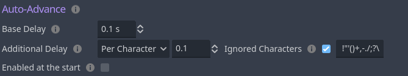

## What is Auto-Advance?

Auto-Advance is an experience-changing feature in Dialogic that allows players to automatically progress through the timeline without requiring user input!\
It's particularly useful for providing a hands-free experience to your players, offering an alternative to traditional "click-to-advance" methods in games.

You may also know this feature by the names "auto-forward" or simply "auto".

## Configuration by the Developer
Let's explore how you can enhance your player's experience with Auto-Advance, taking into account their reading proficiency and the text's complexity.

### Text Settings
In Dialogic's Settings tab, under the Text section, you can find the Auto-Advance settings.

Hover over the tooltip icons to learn more about each settings.


One critical setting is the "Additional Delay", which allows you to choose between "Per Character" and "Per Word".\
These settings modify the pace at which text is displayed, adding extra delays either on character or word count.

### Reading Speed
For Visual Novels, enabling players to set their text speed is a common practice. To provide the same feature using Dialogic, consider setting `Dialogic.Setting.autoadvance_delay_modifier`.

This setting, located within `Dialogic.Setting`, allows you to fine-tune the delay modifier, multiplying "Additional Delay".\
By default, if this value is not set, Dialogic uses a multiplier of 1, causing no change to the delay.

[comment]: <> (TODO: Add a backlink to the Settings documentation)
> **Note:** \
Every setting added to `Dialogic.Setting` is automatically saved and loaded by Dialogic for the *player*.

### Per Word vs. Per Character
Some languages, for instance Japanese, don't separate words by spaces.\
Dialogic uses the popular whitespace used by the spacebar to determine when a word ends and another begins.\
If you plan on providing multiple localisations, you can set both settings via the API.

## Using the Auto-Advance API
With Dialogic's Auto-Advance API, you can effortlessly control and customise the Auto-Advance feature to suit your game's needs. Don't be intimidated; it's more straightforward than you might think!

### Auto-Advance State Information
The state information refers to what's currently being used by Dialogic to decide how Auto-Advance must behave or whether the feature is enabled.

The state information of Auto-Advance is stored in a [Dictionary](https://docs.godotengine.org/en/stable/classes/class_dictionary.html) and can be accessed via `Dialogic.Text.get_autoadvance_info()`.

There are two types of settings in this dictionary:
- **Enable conditions**: `waiting_for_next_event`, `waiting_for_system`, `waiting_for_user_input`
- **Plain Settings**: `fixed_delay`, `per_word_delay`, `per_character_delay`, `await_playing_voice`, …

As long as one of the enable conditions is `true`, Auto-Advance will continue. We recommend to set them via following helper methods:

- `Dialogic.Text.set_autoadvance_until_unread_message(is_enabled: bool)`
- `Dialogic.Text.set_autoadvance_system(is_enabled: bool)`
- `Dialogic.Text.set_autoadvance_until_next_event(is_enabled: bool)`

If you set the enable flags without these methods, Auto-Advancing *won't* start if it's not enabled.
These methods will automatically evaluate whether Auto-Advance shall be turned on or off.

#### Ignored Characters
These characters will be ignored when calculating the text. This feature allows you to further fine-tune your Auto-Advance experience. If you don't need it, simply toggle it off.


### Auto-Advance via BBCode
BBCode tags can enable Auto-Advance via `[aa]` or `[aa = 10]`.\
This forces Auto-Advance to last at least until the next Text Timeline Event.\
If the BBCode provides a valid duration in seconds, Auto-Advance will wait for this amount, ignoring `per_word_delay` and `per_character_delay`, but respecting `await_playing_voice`.

Alternatively, if you want to override the Auto-Advance time for the current event only, add a `?` behind the duration: `[aa = 10?]`.

### Signal
Stay informed about changes in Auto-Advance's state by leveraging the `Dialogic.Text.autoadvance_changed` signal.

```gdscript
signal autoadvance_changed(enabled: bool)
```

If you are interested in how Dialogic uses this signal internally, the `default_input_handler.gd` file connects to this signal:

```gdscript
Dialogic.Text.autoadvance_changed.connect(_on_autoadvance_enabled_change)
```

### API-only Settings

Not all settings are readily available in Dialogic's extension UI.

#### Skipping Voice Clips

The `await_playing_voice` setting within the Auto-Advance's `get_autoadvance_info()` ensures that voice clips finish playing before text advances.\
By default, Dialogic will let all voice clips finish, if you don't want this behaviour, you can disable it via the API:

```gdscript
Text.get_autoadvance_info()["await_playing_voice"] = false
```

#### Per Character and Per Word Delays
To accommodate languages without spaces between words, you can adjust the `per_word_delay` and `per_character_delay` settings using the API.\
 Here's an example of how to configure these settings in your script:

```gdscript
func _ready():
    var auto_advance_info: Dictionary = Dialogic.Text.get_autoadvance_info()
    # We can change the settings by directly writing to the returned dictionary.
    auto_advance_info["per_word_delay"] = 0.3
    auto_advance_info["per_character_delay"] = 0.1
```

Note, if you swap between languages, you'll need to update these settings accordingly if you don't want languages with whitespaces to be affected by both.
