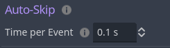

<div class="header-banner purple">
     <div class="header-label purple">Auto-Skip</div>

</div>

*Auto-Skip allows you or the player to quickly advance the timeline.*

## 📜 Content
[toc]

## 1. What is Auto-Skip?

Auto-Skip is the concept of advancing a timeline faster than you can read it.

In Visual Novels, Auto-Skip helps to navigate already known story branches quickly.
If your story is not intended to be cyclic, this feature may not be of use to you.

---

## 2. How to use it?

In Dialogic, Auto-Skip can be enabled and modified from code using the `DialogicAutoSkip` object that can be accessed via the Input subsytem (e.g. `Dialogic.Input.auto_skip`.

The most common way this feature is used, to provide the player with an Auto-Skip toggle button. This section will teach you how to implement the logic for this.

First, you can set the time each event is allowed to take via the Text settings page inside Dialogic.



However, there are many settings that are not exposed to the interface!

---

## 3. Enabling and modifying Auto-Skip

All Auto-Skip settings are variables on the `DialogicAutoSkip` class. This class can be accessed via `Dialogic.Input.auto_skip`. It has a bunch of useful settings:

- `enabled: bool` *If true, dialogic will Auto-Skip.*

**Disable Conditions**

If these settings are on, they tell dialogic to automatically disable Auto-Skip under certain conditions/at certain moments.

- `disable_on_user_input: bool` *If true (by default) dialogic will disable Auto-Skip when the Dialogic Input Action is triggered.*

- `disable_on_unread_text: bool` *If true (by default) dialogic will disable Auto-Skip when any unread text is reached.*

**Enable Condition**

- `enable_on_seen: bool` *If true (by default) dialogic will enable Auto-Skip whenever a text event is reached that you visited before.*

**General Settings**

- `skip_voice: bool` *If true (by default) Auto-Skip will skip voice events instead of playing them.*

- `time_per_event: float` *Defines the time for each event (equivalent to the setting in the Settings>Text page).*

So you can enable Auto-Skip like this:

```gdscript
Dialogic.Input.auto_skip.enabled = !Dialogic.Input.auto_skip.enabled
```

You can use this to quickly advance through your timelines, for example, for debugging purposes. For this you should disable the `disable_on_unread_text` setting like this:

```gdscript
Dialogic.Input.auto_skip.disable_on_unread_text = false
```

```admonish
This is implemented when you use `Play Timeline`. You can enable auto-skip there with the MiddleMouseButton and stop it with any user input.
```

## 4. Reacting to Auto-Skip

### 4.1 Signals

When Auto-Skip is enabled or disabled, the class will emit the
`DialogicAutoSkip.toggled` signal.

Here is an example on how to connect to the signal:

```gdscript
# Connect to the signal.
func _init():
    Dialogic.Input.auto_skip.toggled.connect(_on_auto_skip_toggled)

## If Auto-Skip disables, we want to stop the timer.
func _on_auto_skip_toggled(is_enabled: bool) -> void:
    # Your code reacting to Auto-Skip changes goes here!
```

### 4.2 In Custom Events

Events come in all sort of behaviours: Awaiting signals, instantly executing, a mix of conditions, playing audio, …

It's impossible to let an Auto-Skip handle all of these effects gracefully from the outside. Therefore, Auto-Skip's behaviour must be implemented by each Timeline Event.

#### What type of event do I have?

Does your event finish instantly? Is it playing audio? Awaiting a signal? These situations must be implemented differently.

If you await signals, you can use the `DialogicAutoSkip.toggled` to cause your event to react to Auto-Skip.
The Text Event uses this signal to skip the text animation and then advance the timeline.

If you await a timer or perform an action lasting multiple frames, you can use the `time_per_event` variable to limit the time your event may take.
Here is a code snippet to give you an idea:

```gdscript
var animation_length: float = 10.0

if Dialogic.Input.auto_skip.enabled:
    var time_per_event: float = Dialogic.Input.auto_skip.time_per_event
    animation_length = min(time_per_event, animation_length)
```

This code will cap the animation length to the maximum time set if Auto-Skip is enabled.
