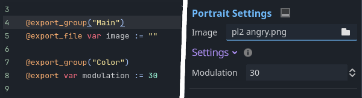

<div class="header-banner pineapple">
     <div class="header-label pineapple">Custom Portraits</div>
</div>

*This page describes when and how to create a custom scene to use for one, multiple, or all portraits in your game.*

## 📜 Content

- [1. Introduction](#1-introduction)
- [2. Requirements](#2-requirements)
- [3. Overwriting methods](#3-overwriting-methods)
- [4. Export Overrides](#4-export-overrides)
- [5. Tips and Tricks](#5-tips-and-tricks)
- [6. Examples](#6-examples)

## 1. Introduction

Oftentimes you want something more complex than a simple image: an animated image (e.g. `AnimatedSprite`), a rigged and animated character, a character with a single body but many face  variations, or something else entirely.

To achieve these, you will have to create a **custom portrait scene**.

One scene can be used for one or multiple portraits. If a scene is used for multiple portraits, switching between them will not re-instance the scene and only call `_update_portrait(@portrait_name)` on that scene (see more below). This allows you to even animate from one portrait to the next.

---

## 2. Requirements

There are not a lot of requirements for portrait scenes:

- **Root needs to be Node2D or Control:**
  *The root nodes need a position and scale property, so it must be a Node2D or Control node (or a subclass).
  Because the root will act as the "pivot-point" it's suggested to use a simple node like Marker2D and have all functional nodes (like sprites, animation players etc.) be children of it.*
- **Root script extends `DialogicPortrait`:**
  *The root nodes script should extend the `DialogicPortrait` class and overwrite some of its methods.*

---

## 3. Overwriting methods

You can customize the behavior by adding a script to the root node and adding specific methods to it. 

Like `_ready` or `_process` these will be called automatically by dialogic when needed, and if implemented:

- **_update_portrait(@character, @portrait_name):**
  *This method is called when the portrait is instanced and when a change to another portrait using the same scene is performed. For example, you could play a specific animation in an `AnimatedSprite` based on the portrait name or show a specific image.*

- **_set_mirror(@mirrored):**
  *Different scenes might want to mirror differently (AnimationSprite.flip_h; self.scale.x = -1, etc.). Thus, you will have to implement this functionality yourself.*

- **_get_covered_rect() -> Rect2:**
  *This is used for correctly sizing your scene, as it's mostly impossible to know the size of your portrait. If you implement this and return a rect2 that covers your portrait (relative to the root node's position), the portrait_containers size modes and the character editors `Full View` will work.*

- **_set_extra_data(@data_string):**
  *The Character event Join/Update mode allows specifying some extra information in the text editor. If some information is given, this method will be called. This can be very useful to enable certain things. For example, your character could have different modes or items.*

- **_should_do_portrait_update(@character, @portrait_name):**
  *Rarely needed, but if overridden this will be checked, if the portrait change is performed to a portrait with the same scene. If you return false, then this instance will be deleted and a new instance will be made. If not implemented, this defaults to true, meaning this instance will be used for the portrait update too.*

---

## 4. Export overrides

If you add exported variables to your scene's script, you can change their values in the portrait settings in the character editor.
This allows you to change these values for different portraits that use the same scene.

```gdscript
@export_file var image := ""
@export var modulation := Color.WHITE
```

*This will add an image and modulation setting to all portraits using this scene.*

If you define an export group called `Main` all the settings in it will be displayed above the others (which are grouped under `Settings`):



---

## 5. Tips and Tricks

In most portraits, you should call `apply_character_and_portrait()` as the first thing in your `_update_portrait()` method. This method simply sets the character and portrait and will switch the portrait string to the default portrait if the portrait is not valid.

```gdscript
func _update_portrait(passed_character:DialogicCharacter, passed_portrait:String) -> void:
    apply_character_and_portrait(passed_character, passed_portrait)
```

Simple image-based scenes (that use `Sprite` or `TextureRect`) can use the `apply_texture` method, which takes the displaying node and an image path. If you do so, the portrait class will also automatically handle `_get_covered_rect()` and `_set_mirror()` for you.

```gdscript
func _update_portrait(passed_character:DialogicCharacter, passed_portrait:String) -> void:
    apply_character_and_portrait(passed_character, passed_portrait)
    
    # $Portrait is a TextureRect or Sprite
    # image is an exported string
    apply_texture($Portrait, image)
```

---

## 6. Examples

Besides the `DefaultPortrait` scene (in `addons/dialogic/Other`) there are some example scenes in `addons/dialogic/Example Assets/Portraits`, that implement some or all of these methods to achieve different effects.

Take a look at them if you feel unsure how to implement a valid portrait scene!
