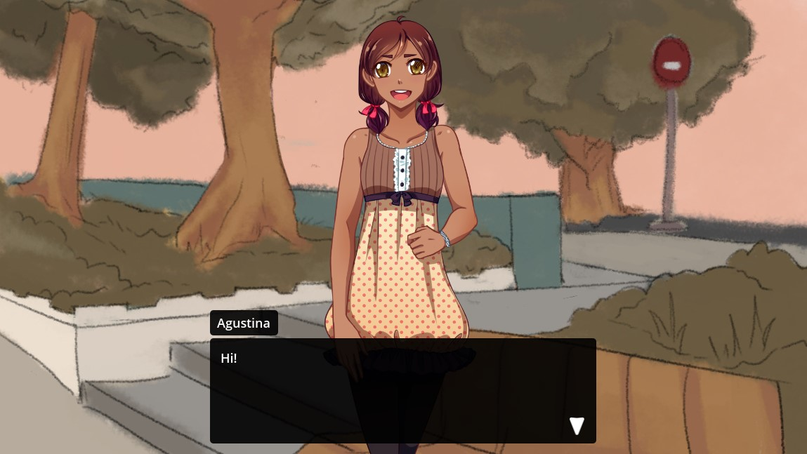

<div class="header-banner tropical">
     <div class="header-label tropical">Character Event</div>
</div>

*The character event is used for characters that have portraits. It allows joining, leaving and updating them and configuring how they appear in the game.*

## 📜 Content

[TOC]

## Text Syntax

```dtl
# Basic join event
join MyCharacter center
# Specifying a portrait and shortcode parameters
join MyCharacter (SomePortrait) center [animation="Bounce In"]
# Character with a space in the name and a portrait that's inside a group
join "My Character" (Special/Crazy) center
# Specifying the transform manually
join MyCharacter pos=x0.5y1 size=y400px rot=20`

# Basic leave event
leave MyCharacter
# Specifying shortcode parameters
leave MyCharacter [animation="Fade Down"]
# Leaving all joined characters
leave --All--

# Update that animates the character
update MyCharacter [animation="Tada" length="2" wait="true"]
# Update that changes the position (and tweens it)
update MyCharacter left [move_time="1" move_trans="Elastic" move_ease="In"]
# Update that changes the portrait
update MyCharacter (OtherPortrait) [fade_time="0.5"]
```

---

## The Main Settings

### Action Setting | Join / Leave / Update

The character event knows three modes `Join`, `Leave` and `Update`.

**Join** events will add a character. They require a position/transform to be given and will use `In`-Animations.

**Leave** events will remove one or all characters. They ignore most settings and will use `Out`-Animations.

**Update** events allow you to change stuff, like the position or portrait. They can also be used to animate the character. They have a few settings that Join and Leave don't use: Fade and Fade Time, Move Time, Move Trans and Move Ease. Also the Update event will only change a setting if it has been set, so if no portrait is given the previous portrait is kept, same for the position, etc.

**Text Syntax:**
The mode is set by starting the event with either `join`, `leave` or `update`

---

### Character Setting

The character that is going to be used. In `Leave`-mode this can be `--All--` characters.

**Text Syntax:** `join MyCharacter` , `leave "My Character"`, `leave --All--`

Right after join/leave/update put the character identifier. If the identifier contains a space, you have to put the identifier in quotes.

---

### Portrait Setting

**Text Syntax:** After the character identifier put the portrait in `(`brackets`)`: `join MyCharacter (MyPortrait)`

The portrait that should be used. If none is given, `Join` mode will use the characters default portrait, while `Update` mode will just not change the portrait.

Portraits that are in groups have to be specified by full path: `Group/SubGroup/Portrait`

The portrait setting can be an expression inside `{`curly brackets`}`, for example a variable: `{PlayerPortrait}`. The experssion will be evaluated and interpreted as a string that should be the name/path of a portrait.

---

### Position/Transform Setting

This setting defines where on screen your character is positioned. When you character is joined it will be put in a brand new `PortraitContainer`, which you can then change the position, size and rotation of with the transform setting. There are two ways to do so:

- Using a **preset "position"** you can easily copy the tranform of one of the `PortraitContainers` defined in your style by using one of it's identifiers. By default dialogic provides 5 of these preset positions, named "leftmost", "left", "center", "right", "rightmost".

- Using **transform commands** you can position, size and rotate the container with more control. For example `pos=x0.5y1 size=y400px rot=20`.

##### Using a Preset Positions

Moving the container to a preset position is as easy as writing the name of that position.

In the default "5-Portraits" style layer the defined positions are `leftmost`,`left`, `center`, `right`, `rightmost`.

```admonish
If you want more/other preset positions you will have to create a custom portrait layer.
You then have to change the position names that will be suggested in the timeline editor in the Settings>Portraits.
```

##### Using Transform Commands

There are three transform commands: `pos=` (position), `size=` and `rot=` (rotation).

**Position and size** can be specified like this: `x0.5 y1`, `x100px y1%` 
By default x and y are interpreted as relative to the viewport size, meaning 0.5 means half the width/height of the window.

Position defines the ORIGIN of the portrait (usually the bottom center). This means a position of `x0.5 y1` will position the portrait like this:

 

When first joining a character, the position, size and rotation will be copied from the first portrait preset found. This means if you just want to vary the position along the x axis, a simple `pos=x0.3` is usually enough and all the other values will be correct by default.

**Rotation** is given in degrees. The portrait rotates around it's origin (usually the bottom center)!

---

---

## The Other Settings

In the text editor these settings are all stored as parameters in the shortcode at the end of the event.

E.g. `join MyCharacter center [animation="Bounce" length="1" mirrored="true" ]`

### Animation Setting

**Text Syntax:** `animation="Bounce"`

The animation setting allows you to set an animation that should be used. The selection of animations is different depending on the mode. 

If no animation is given, `Join` and `Leave` will fallback to defaults that can be set in Settings>Portraits, while `Update` won't play any animation.

The animation name is quite forgiving meaning `Fade Up`, `fade up in` `fade In Up` will all point to the right animation (assuming this is a join event).

You can add animations to dialogic with extensions: [Creating Extensions](./creating-extensions.md)

### Animation Length Setting

**Text Syntax:** `length="2"` / `length="0.5"`

If an animation is set, this defines the length of the animation in seconds.

### Animation Wait Setting

**Text Syntax:** `wait="true"` / `wait="false"`

If an animation is set, this defines, whether to wait for the animation to finish before going to the next event.

### Animation Repeat Setting

**Text Syntax:** `repeat="2"`

The animation repeat setting (exclusive to the `Update` mode) allows repeating the animation multiple times.

---

### Fade Setting

**Text Syntax:** `fade="Fade"`

The fade setting (exclusive to the `Update` mode and only relevant if the portrait changes) defines the Crossfade animation that is used to fade from the last portrait to the next. If none is given it will fall back to a default that can be set in Setting>Portraits.

### Fade Length Setting

**Text Syntax:** `fade_length="0.5"`

Defines the length of the fade in seconds.

---

### Z-Index Setting

**Text Syntax:** `z_index="2"`

The z-index allows you to sort your characters. It is *not* using godot's z-index and instead sorting the characters manually!

---

### Mirror Setting

**Text Syntax:** `mirrored="true"`

Allows mirroring the portrait.

---

### Move Settings

**Text Syntax:** `move_time="0.8"` / `move_trans="Elastic"` / `move_ease="In Out"`

On `Update` events that change the position you can set the time (in seconds), transition and easing used to tween from the old to the new position.

Easings: `In`, `Out`, `In Out` `Out In`

Transitions: `Linear`, `Sine`, `Quint`, `Quart`, `Expo`, `Elastic`, `Cubic`, `Circ`, `Bounce`, `Back`, `Spring`

See this [Easing Cheat Sheet](https://raw.githubusercontent.com/godotengine/godot-docs/master/img/tween_cheatsheet.webp) for something more visual.

---

### Extra Data Setting

**Text Syntax:** `extra_data="something"`

The extra data is given to the portrait scene and allows communicating with the portrait scene directly from the timeline. It can be evaluated from the `_set_extra_data(data:String)` method on [custom portraits](./custom-portraits.md).
