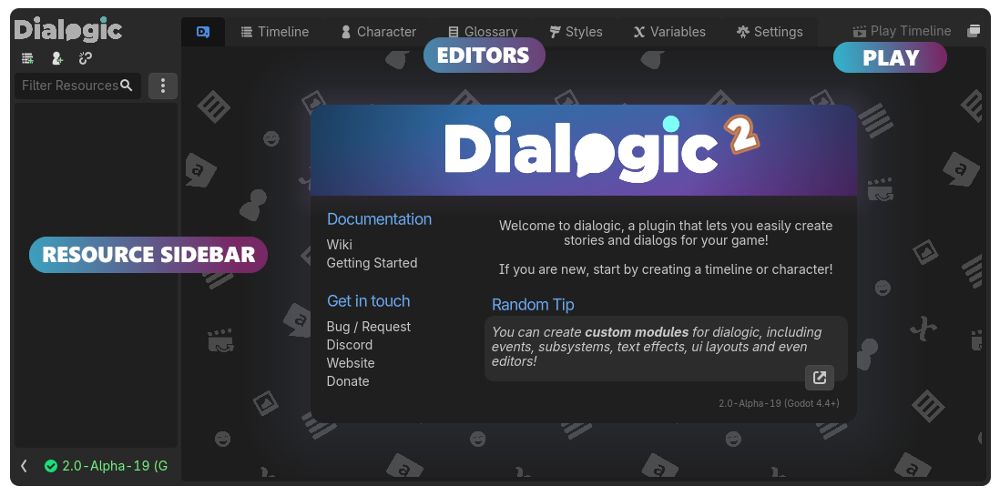

<div class="header-banner blurple">
     <div class="header-label blurple">Getting Started</div>
</div>

*This tutorial teaches you how to install Dialogic and gives a quick overview of the necessary elements you need to know for making a dialog appear in your game.*

## 📜 Content
[toc]

## 1. Installation & Activation

Dialogic 2 requires Godot 4.4 or higher. If you don't know what version you have installed, take a look at the bottom of your Godot Editor.

Let's install Dialogic 2:

- Download the ZIP file here for your desired Dialogic version: [GitHub Dialogic Releases](https://github.com/dialogic-godot/dialogic/releases).
- Extract the `addons` folder from this ZIP-file, it contains Dialogic.
- Move the `addons` folder to your Dialogic project folder.

Now, let's verify you have correctly installed Dialogic:

- You have this folder path `res://addons/dialogic`
- Head to `Project > Project Settings`
- Click the `Plugins` tab.
- Tick the `enabled` button next to Dialogic.
- Restart Godot

## 🚧 Installing the latest WIP Version (main branch)

Dialogic is constantly evolving. Oftentimes, fixes for bugs or new features might only be available on the main branch. This is especially true during the alpha and beta phases. If you are interested in using the main developement branch, it's easy to do so.
Go to [the main page of the repository](https://github.com/dialogic-godot/dialogic) and click on the green `Code` button, then press the `Download ZIP` button. From there, you can install that ZIP's content like a release.

---

## 2. Meeting the editor

You can now access the dialogic interface by clicking the new tab at the very top (next to 2D, 3D, Script, Game and AssetLib).


You will be greeted by the dialogic home screen. At the top you can see the different editors dialogic has, at the left a sidebar that will contain recently used characters and timelines and where you can create new timelines and characters.



---

## 3. Creating a timeline

To create a timeline, press the `Add Timeline` button in the sidebar. You will need to select a folder to put the timeline in and enter a file name. Timelines will be saved as `*.dtl` files.

Once you hit `Save`, you can start adding events from the panel to the right of the editor.


*Tip: You can learn more about each event and its settings by right-clicking on the event and selecting `Documentation`.*

If you like, you can switch to the text editor by clicking on the `Text Editor` button at the top right. You can find out more about writing timelines in text format here: [Writing timelines in text format](timeline-text-syntax.md).

You can test the timeline by clicking the `Play Timeline` button at the top right.

---

## 4. Creating a character

To create a new character, press the `Add Character` button in the sidebar.

As for timelines, you need to select the place to save to and a name.

> [!NOTE]
> This name (without `.dch`) is what will be saved whenever you use that character in a timeline and what you will have to write when referencing the character (e.g. `Emilio: This is a text event.`, if the file is named `Emilio.dch`). So make sure to give it a good name.
> You can change the name that will actually be displayed in game as the `display_name` property.


Once your character is created, you will see the character editor. This editor has four main sections.


You can learn more about portraits, custom portraits, and the character settings in this tutorial: [Characters & Portraits](characters-and-portraits.md)

---

## 5. Adding dialog to your game

The last important step is to actually have your dialog show up in your game.

For that, we need two things:

- A) to have nodes that can display our timeline
- B) to start the execution of the timeline.

Luckily for us, Dialogic provides a method that does both of those: `Dialogic.start(timeline_name_or_path)`

*So the code to start your dialog when an input is pressed could look like this:*

```gdscript
func _input(event: InputEvent):
    # check if a dialog is already running
    if Dialogic.current_timeline != null:
        return

    if event is InputEventKey and event.keycode == KEY_ENTER and event.pressed:
        Dialogic.start('chapterA')
        get_viewport().set_input_as_handled()
```

## You have got started!

Congratulations! You now know the basics of Dialogic. There is much more to learn, though. Here is a list of tutorials you might want to explore next:

- [Writing timelines in text format](timeline-text-syntax.md)
- [Characters and Portraits](characters-and-portraits.md)
- [Creating timelines in code](creating-timelines-in-code.md)
- [Styles and Layouts](styles-and-layouts.md)
