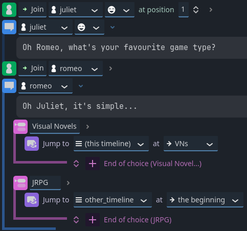
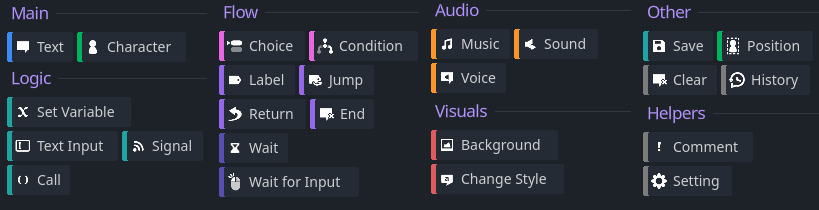

<div class="header-banner dawn">
     <div class="header-label dawn">Introduction to Dialogic 2</div>
</div>

> [!IMPORTANT]
> This documentation is for Dialogic 2.
> Dialogic 2 is still in-development and marked as Alpha, there may be workflow breakage!


## 📜 Content
[toc]

## What is Dialogic 2?

The Dialogic plugin allows you to easily create **in-game dialogs** or fully fledged **Visual Novels** with Godot.

Let's get an overview of what Dialogic 2 can do for you!

### 1. Timelines!

Timelines represent your Dialogs. They are a list of events (e.g. text, conditions, animations, signals, etc.) and control the flow of your story. You can edit them in a writer-friendly **Visual Editor**, our very efficient **Text Editor** or any text editor of your choice.

The **Visual Editor** has each event as a movable block with easy to use fields:


The **Text Editor** allows you to write events in pure text format. It provides syntax highlighting and auto-completion making writing timelines super efficient. You can use any text editor, though. Here is the same timeline in the text format:

```dtl
join Juliet left
Juliet: Oh Romeo, what's your favorite game type?
join Romeo right
Romeo: Oh Juliet, it's simple...
- Visual Novels
	jump VNs
- JRPGs
	jump other_timeline/
```

No strings attached; you can mix and match as you please!

### 2. Events

Each timeline contains events, and Dialogic equips you with many built-in ones to get your story started today! And when you reach their limit, you can easily create more.



### 3. Customization by design

Cannot find the right Event? Need more options for your character portraits? You want to simplify how your designer can adjust the theme of your game?

It's all here and ready for you. Dialogic 2 is easy to use for writers and powerful but intuitive to extend for programmers.

[Create your own specific Events](creating-extensions.md) with very little code, and your designers can instantly use them as if they were part of Dialogic.

### 4. Character system and editor

An entire system to create and manage your characters, with a built-in editor inside Dialogic.
No need to program anything; just create your characters and use them in your timelines.

### There is more!

We are just scratching the surface of what's possible.\
Here is a small list of other things you can do:

- [Create events and timelines in code!](creating-timelines-in-code)

- Use built-in "text actions", for instance `[speed]`, `[pause]`, `[signal]`, `[portrait]`.

- [Easy-to-use variables in your timelines!](variables.md)

- Create a glossary for words and let your players hover over them to discover their definition.

- [Translate characters and timelines](translation.md) with the integrated CSV file system!

- [Seamlessly create Custom Events](creating-extensions.md); they are all scripts! (`.gd`).

- Access functionality from code, for instance, `"Dialogic.Portraits.change_portrait(Emilio, "happy")`, `Dialogic.Backgrounds.update_background("res://icon.png")`

## How do I get started?

First, [let's get Dialogic up and running](getting-started)! After this step, the numerous pages on the left-side navigation bar will aid you with your dialog-driven game adventure!

Need further details? Try the search or open an issue on the GitHub repository!

---

## Can I upgrade from Dialogic 1 to Dialogic 2?

There are several problems to overcome when upgrading from Dialogic 1.

First, Dialogic 1 is exclusively for Godot 3.x, while Dialogic 2 requires Godot 4.3 or higher.
Hence, your project must work in that Godot version first, it's a very different engine with plenty of changes.

If you have already made a lot of progress in your game, there is no reason to upgrade. We recommend you stick to Godot 3 and Dialogic 1.
