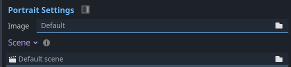
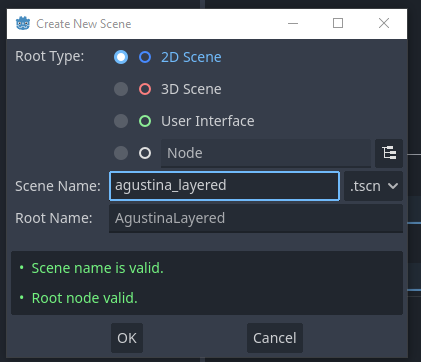
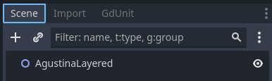
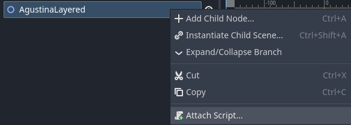
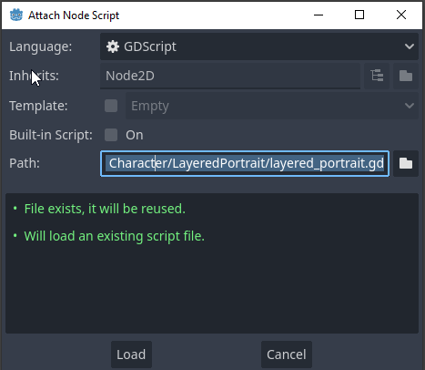
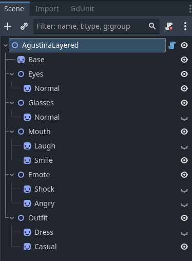
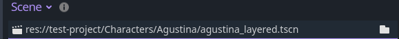

<div class="header-banner pineapple">
     <div class="header-label pineapple">Layered Portraits</div>
</div>

*This page describes how to create layered portraits.*

## 📜 Content
[toc]

## 1. Introduction

If you want to have a character with multiple layers, like a body, a head, and
a mouth, you can use the **Layered Portrait** feature.

Dialogic uses the concept of Godot scenes to create portraits. The layered portrait feature provides us with a GDScript that you can use for this purpose.

If you are eager to learn more about the requirements for creating a custom portrait, please refer to the [Custom Portraits](custom-portraits.md) page.


## 2. Rundown

You will learn to create a new character, add a new portrait, and then create a
new Godot scene for the custom scene of this portrait.\
Finally, you will learn how to control the layers of the portrait using the
timeline.


## 2.1. Preparation

I will use a character named `Agustina`, if you want to follow along, you can download the assets from [https://dejinyucu.itch.io/agustina-visual-novel-sprite](https://dejinyucu.itch.io/agustina-visual-novel-sprite).\
Heads up: The character is available as a PSD file; you will have to pick the
layers and export them as image files.


## 3. Creating a new Character

First, head over to the Dialogic Character tab. You will need to create
yourself a new character or edit an existing one.

Each character can have multiple portraits. You can add a new portrait or use
an existing one.

Heading over to the last segment of the Character Editor, you will find the
preview and the **Portrait Settings**.\
Unfold the **Scene** option, and you will see a file picker. We will head back
here once the scene file is done, set it.




## 4. Creating a Portrait Scene

Now, we want to create a new scene in the **FileSystem** tab of Godot.
We recommend creating a new folder for your portrait scenes, so you can keep
your project organized.

Right-click on the folder and hover **Create New**, and click **Scene...** on the
follow-up menu.

Select the **Root Type**, we recommend using a **2D Scene**. The **Scene Name**
is up to you, but once again, we recommend keeping your project organized with
a consistent naming scheme.



Once you press **OK**, your new scene will be opened in the **Scene** tab of
Godot. Switch to the **2D** tab in the upper-middle of Godot, and you will see
your new scene.



## 4.1. Adding the Layered Portrait GDScript

To use your scene as a layered portrait, we will add a built-in
GDScript to the root node of your scene.

Right-click on the root node and hover over **Attach Script**.



You can copy the following path and paste it into the **Path** field:

```
res://addons/dialogic/Modules/Character/LayeredPortrait/layered_portrait.gd
```



Press **Load** and... that's it! You have now added the Layered Portrait
scripting logic; now onto the fun part!

```admonish info
The script may open in the **Script** tab of Godot or an external editor,
feel free to ignore this and move back to the **2D** tab.\
It's not recommended to edit this file without copying it to your own project's
folder.
```

## 4.2. Adding the Layers

Your layered portrait can have multiple layers. We recommend using `Node2D` as
grouping layers, and `Sprite` as the actual layers.

This will require some manual work, but it gives you control over how the
layers are organized. The node paths will be used in the
**Layer Command Syntax**; we will cover this in a later section.


Here is my scene structure:



I left some of the layers hidden to define the default look of the portrait.

## 4.3. Setting the Layered Portrait Scene

Remember the file picker in the Character editor? Now is the time to use it!
Copy the path of your scene file and paste it into the file picker or navigate
to your scene file.



Once you have selected your scene file, you should be able to see your portrait
in the Character Editor's Preview.


## 5. Controlling the Layers

As of right now, you can use the `Character` event to control the layers.
The functionality is limited to the `join` and `update` variants of this event.

In Dialogic, this event accepts a parameter called `extra_data`. Using the Layer
Command Syntax, you can control the portraits from timelines using the
`extra_data`.

Take a look at this example:
```tml
join agustina (Layered) 2 [animation="Heartbeat" extra_data="set Mouth/Smile"]
```

## 5.1. Layer Command Syntax

Here is a list of valid commands you can use in the `extra_data` parameter:

```tml
# Show an entire group:
show Group1

# Show a layer, does not hide others:
show Group1/Layer1

# Hide a group:
hide Group1

# Hide a layer:
hide Group1/Layer1

# Show only one layer and hide the others:
set Group1/Layer1
```

If you want to use multiple commands in one `extra_data` parameter, you can
separate them with a comma:

```tml
update agustina [extra_data="show Glasses/Normal, set Emote/Shock"]
```

# 6. FAQ

## 6.1. My Portrait is hovering above the Scene Ground

Make sure all of your layers have the correct size.

The Layered Portrait will use the size of all layers combined. If one layer is
extending further down than the others, it may appear floating above the ground
if the layer is not enabled.

Try enabling all of your layers and select all nodes, you will be able to see
all boundaries in the editor window of your scene.


## 6.2 My Portrait's Position is heavily off

If you use a `Control` (and comparable types), ensure that its position aligns
with the root's position. Otherwise, the overall coverage of your portrait
will be visually unpredictable in the editor.


## 6.3 Do I have to use `CanvasGroup` as Root Node?

No, but if you use any transitions on your layered sprite, the player will see
every single layer fading at once.

If you have a Skin Layer covered mostly by a Dress Layer, you will see the Skin
and Dress layer fading in and out separately.
