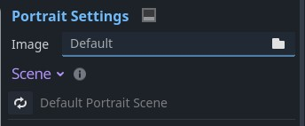
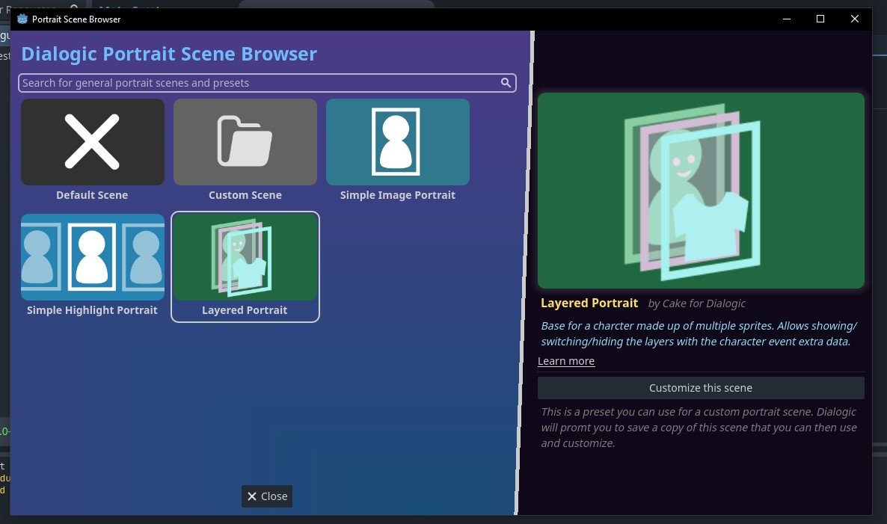
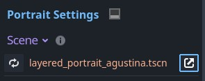
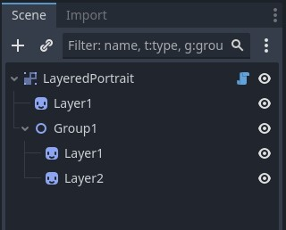
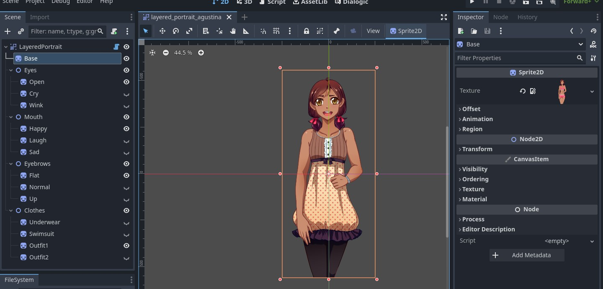
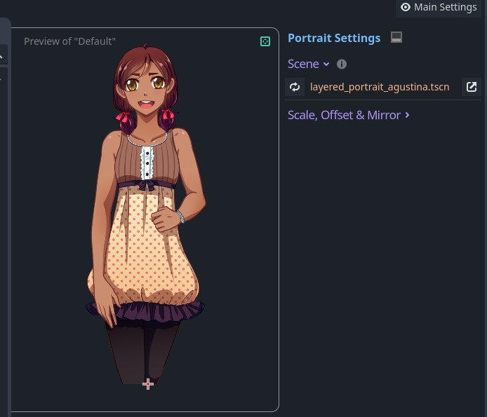

<div class="header-banner pineapple">
     <div class="header-label pineapple">Layered Portraits</div>
</div>

*This page describes how to create and use layered portrait scenes.*

## 📜 Content

[toc]

## 1. Introduction

If you want to have a character with multiple layers, like a body, a head, and a mouth, you can use the custom **Layered Portrait** scene. This scene allows creating a character from many sprites and then allows showing, hiding and switching between these sprites **from the timeline!**

If you are eager to learn more about how dialogic uses scenes to create portraits and the requirements for creating a custom portrait, please refer to the [Custom Portraits](custom-portraits.md) page.

## 2. Rundown

First, you will learn how to create a new layered portrait scene and set it up correctly.

Finally, you will learn how to control the layers of the portrait using the timeline.

## 2.1. Preparation

I will use a character named `Agustina`, if you want to follow along, you can download the assets from [https://dejinyucu.itch.io/agustina-visual-novel-sprite](https://dejinyucu.itch.io/agustina-visual-novel-sprite).

*Heads up: The character is available as a PSD file; you will have to pick the layers and export them as image files.*

You will also have to have a character. You can use an existing one or create a new one for this. On that character (in the Character Editor) add or select a portrait. 

## 3. Creating the Base Layered Portrait Scene

In the Character Editors "Portrait Settings" section, head to the **Scene** section. 



Click the little arrows icon to change the portrait scene.

In the popup that opens select the `Layered Portrait` and then click `Customize This Scene`.



This will promt you to save the new scene somewhere in the file system. Navigate to a place that makes sense in your file oranization and adjust the file name if necessary. Then click `Save`. 

You can now open this scene with the little arrow icon button (or from the file system).



## 4. Filling the scene

At the beginning the scene will have only a few nodes to get you started:



You will usually have a "Base" layer, which should be the first Sprite we add. So we select the first Sprite, rename it to "Base", and drag our base texture into the inspectors `Texture` property.

For anything you have "variations" of, in this case for example the Eyes, Eyebrows, Mouths and Clothes, you'll want to have a "Group", like the one that is already in the scene. A group will later allow us to easily switch between these variations.

By adding more Groups (Node2D) and Sprites (Sprite2D), naming them properly (we will use these later) and setting the textures, we will get something like this:



*Note: The Sprites of the Augustina example all fill the same rectangle. This means they are automatically all correctly positioned on top of each other. If your sprites cover different regions of the character, you might have to manually move them to be positioned correctly.*


Save the scene and head back to the character editor. If everything went right, you should now see your scene there:



Hurray!

## 5. Controlling the Layers from the timeline

You can control these layers from the character event (when joining or updating). Any communication with the portrait scene happens via the `extra_data` parameter, for example like this:

```tml
join Agustina center [extra_data="set Mouth/Happy"]
[wait_input]
update Agustina [extra_data="set Eyes/Wink, set Mouth/Laugh, set Clothes/Outfit2"]
```

In the visual editor you can use the same commands in the "Extra Data" field.

## 5.1. Layer Command Syntax

Here is a list of valid commands you can use in the `extra_data` parameter:

```tml
# Show an entire group:
show Group1

# Show a layer, does not hide others:
show Group1/Layer1

# Hide a group:
hide Group1

# Hide a layer:
hide Group1/Layer1

# Show only one layer and hide the others:
set Group1/Layer1
```

If you want to use multiple commands in one `extra_data` parameter, you can
separate them with a comma:

```tml
update agustina [extra_data="show Glasses/Normal, set Emote/Shock"]
```

# 6. FAQ

## 6.1. My Portrait's Position is wrong

The layered portrait calculate the combined size of all the layers. If your layers have different sizes/positions, make sure no layer extends further then needed. Try enabling all of your layers and select all nodes, you will be able to see all boundaries in the editor window of your scene.

By default the Layered Portraits scripts `fix_offset` parameter (in the inspector under Layered Portrait/Private/fix_offset) is on. This will adjust the position based on the first sprite on the assumption that it will be the base sprite. For many portraits that makes it easier, but for more granular control you can turn it off. In that case your sprites should be positioned so that the top-left corner of your character is at the scene origin!

## 6.2 Do I have to use `CanvasGroup` as Root Node?

No, but it's the best at handling transitions.
