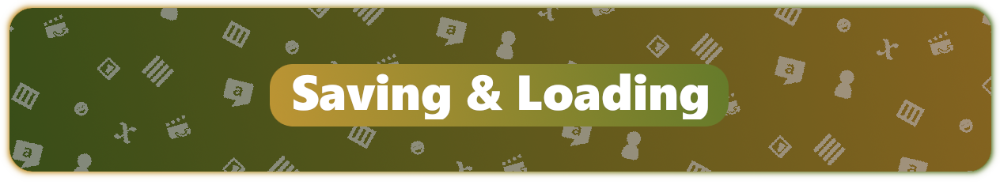

Obviously many games require the ability to save and load.

# Manual saving

You can get the current state of dialogic with `Dialogic.get_full_state() -> Dictionary` and load it back in (potentially after having it saved somewhere) with `Dialogic.load_full_state(state:Dictionary)`.

# Built-in saving

The saving subsystem allows to save and load easily, including creating a screen-shot and saving to multiple slots. 

## Main methods

Here are the relevant methods:

- `Dialogic.Save.save(@slot, @is_autosave, @create_screenshot)`

- `Dialogic.Save.load(@slot)`

- `Dialogic.Save.get_slot_names()`

- `Dialogic.Save.remove_slot(@slot)`

- `Dialogic.Save.reset_slot(@slot)`

- `Dialogic.Save.get_slot_image(@slot)`

There are more methods, but these should mostly be enough. By not specifying a slot, you will use the last slot that was specified (or the default slot if none was specified before).

## Additional data

You can also save additional data with 

- `Dialogic.Save.save_file(@slot, @file_name, @data)`

- `Dialogic.Save.load_file(@slot, @file_name, @default)`

For example if you have your game data in a dictionary your code could look like this:

```gdscript
func save_game():
    var game_data = {"player_pos":$Player.position}
    Dialogic.Save.save('MySlot', false true)
    Dialogic.Save.save_file('MySlot', 'GameData.txt', game_data)

func load_game():
    Dialogic.Save.load('MySlot')
    print(Dialogic.Save.load_file('MySlot', 'GameData.txt', {}))
```

## Global data

You can save info that should be slot-independant (like settings, etc) with `Dialogic.Save.set_global_info(key, value)` and retrieve it with `Dialogic.Save.get_global_info(key, default)`.
